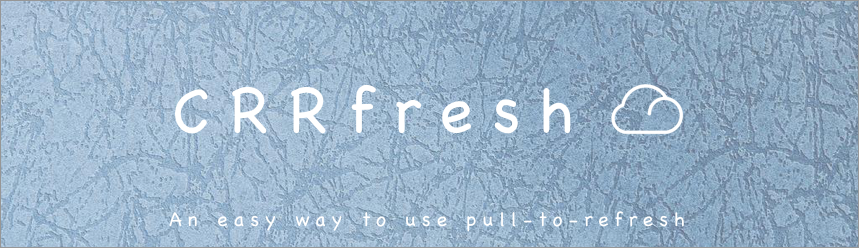
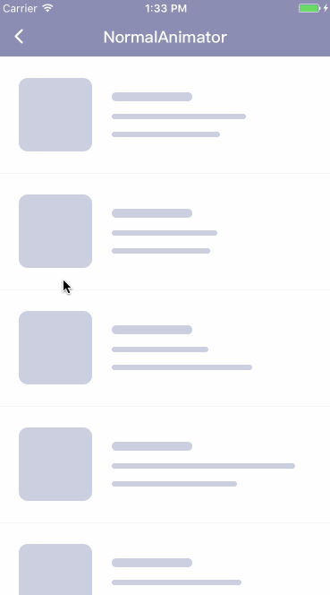
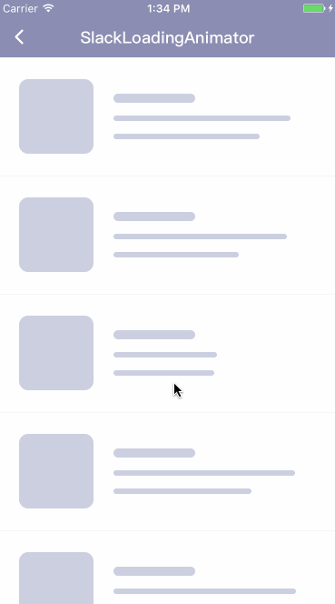
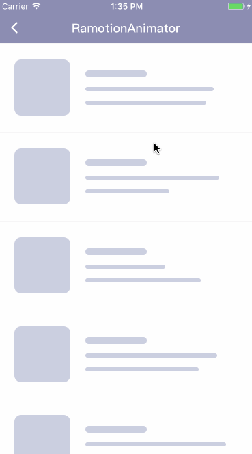
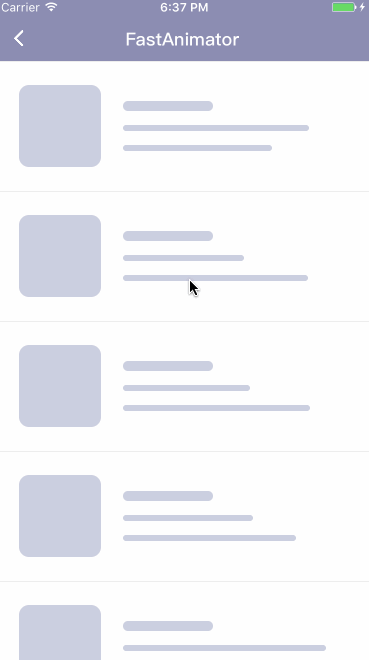

[](http://cocoapods.org/pods/CRRefresh)
[](http://cocoapods.org/pods/CRRefresh)
[](http://cocoapods.org/pods/CRRefresh)
[](https://www.apple.com/nl/ios/) 




**CRRefresh** an easy way to use pull-to-refresh, If you want to customize its UI style, you just need conform the specified protocol. We will not regularly updated some nice dynamic effect, at the same time also welcome to write to me ~ 

[中文介绍](README_CN.md) / [博客介绍](http://blog.csdn.net/wang631106979/article/details/62888435)

## Screenshots

|  |     |  |
| :-----------------: | :--------------------: | :-----------------: |
|  `NormalAnimator`   | `SlackLoadingAnimator` | `RamotionAnimator`  |
|  |                        |                     |
|   `FastAnimator`    |                        |                     |

## Requirements

- Xcode 8 or later
- iOS 8.0 or later
- ARC
- Swift 3.0 or later

## Features

- Support `UIScrollView` and its subclasses `UICollectionView` `UITableView` `UITextView`
- Pull-Down to refresh and Pull-Up to load more
- Support customize your own style(s)

## Installation

### CocoaPods

CocoaPods is the recommended way to add CRRefresh to your project.

Add a pod entry for CRRefresh to your Podfile.

```ruby
pod 'CRRefresh'
```

Second, install CRRefresh into your project:

```ruby
pod install
```
### Carthage

[Carthage](https://github.com/Carthage/Carthage) is a decentralized dependency manager that builds your dependencies and provides you with binary frameworks. To integrate `CRRefresh` into your Xcode project using Carthage, specify it in your `Cartfile`:

```
github "CRAnimation/CRRefresh"
```

Run `carthage update` to build the framework and drag the built `CRRefresh.framework` (in Carthage/Build/iOS folder) into your Xcode project (Linked Frameworks and Libraries in `Targets`).

### Manually

1. Download the latest code version .
2. Open your project in Xcode,drag the `CRRefresh` folder into your project. Make sure to select Copy items when asked if you extracted the code archive outside of your project.
3. You need it with `import CRRefresh `.

## Usage


**Add `CRRefresh` to your project**

```swift
import CRRefresh
```

**Add pull-to-refresh**

```swift
/// animator: your customize animator, default is NormalHeaderAnimator
tableView.cr.addHeadRefresh(animator: NormalHeaderAnimator()) { [weak self] in
    /// start refresh
    /// Do anything you want...
    DispatchQueue.main.asyncAfter(deadline: .now() + 2, execute: {
        /// Stop refresh when your job finished, it will reset refresh footer if completion is true
        self?.tableView.cr.endHeaderRefresh()
    })
}
/// manual refresh
tableView.cr.beginHeaderRefresh()
```

**Add infinite-scrolling**

```swift
/// animator: your customize animator, default is NormalFootAnimator
tableView.cr.addFootRefresh(animator: NormalFootAnimator()) { [weak self] in
    /// start refresh
    /// Do anything you want...
    DispatchQueue.main.asyncAfter(deadline: .now() + 2, execute: {
        /// If common end
        self?.tableView.cr.endLoadingMore()
        /// If no more data
        self?.tableView.cr.noticeNoMoreData()
		/// Reset no more data
		self?.tableView.cr.resetNoMore()
    })
}
```

## Customize Style

Customize refresh need conform the **CRRefreshProtocol**  protocol.

```swift
public protocol CRRefreshProtocol {
    /// Customize view
    var view: UIView {get}
    
    /// View insets
    var insets: UIEdgeInsets {set get}
    
    /// The height of the trigger to refresh
    var trigger: CGFloat {set get}
    
    /// The height of the animation is executed
    var execute: CGFloat {set get}
    
    /// Start refresh
    mutating func refreshBegin(view: CRRefreshComponent)
    
    /// End refresh
    mutating func refreshEnd(view: CRRefreshComponent, finish: Bool)
    
    /// Refresh the progress changes
    mutating func refresh(view: CRRefreshComponent, progressDidChange progress: CGFloat)
    
    /// Refresh the state changes
    mutating func refresh(view: CRRefreshComponent, stateDidChange state: CRRefreshState)
}
```

## Remove

```swift
tableView.cr.removeFooter()
tableView.cr.removeHeader()
```

## Contribution

You are welcome to contribute to the project by forking the repo, modifying the code and opening issues or pull requests.

## Contacts

If you wish to contact me

- Email: wangchonglei93@icloud.com
- Github: https://github.com/imwcl
- QQ: 631106979
- Dynamic effect study group: 547897182

## License

CRRefresh is released under the [MIT license](LICENSE). See LICENSE for details.

